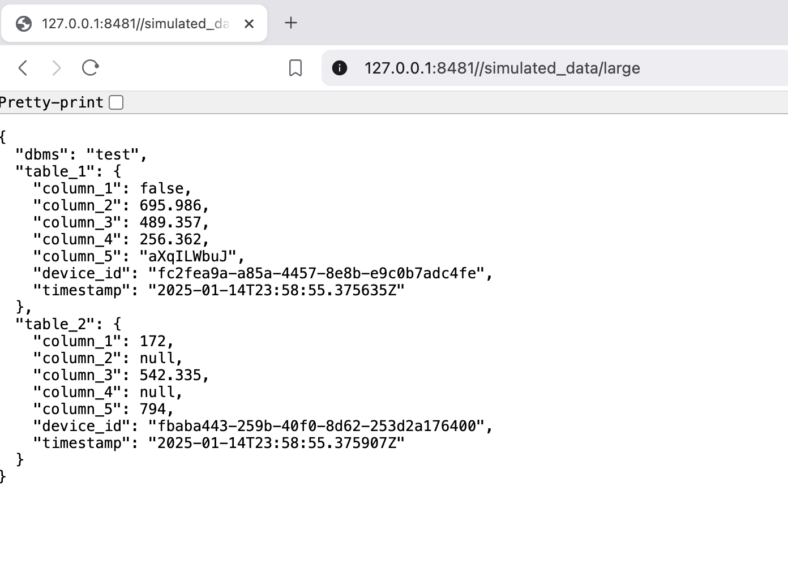

# Sample Data Generator

The following provides an array of data sets to be stored into AnyLog/EdgeLake via _REST_ (PUT and POST), _MQTT_ and 
_Kafka_. 

### Requirements
* Docker

<div align="center"><b>- OR -</b></div>

* Python>=3.9 with the following [requirements](requirements.txt)
  * Flask==2.2.2 
  * tensorflow==2.11.0 
  * numpy==1.23.5 
  * opencv-python-headless==4.6.0.66 
  * requests==2.28.1 
  * kafka-python==2.0.2 
  * paho-mqtt==1.6.1 
  * concurrent.futures==3.1.1
  * pyyaml==6.0 
  * pandas==1.5.2

### Options
```README.md
    positional arguments:
        data_type       data to generate
        - ping
        - percentagecpu
        - rand
        - r_50
        - large
        - car
        - people
        - factory
        publisher       format to publish data
        - put
        - post
        - mqtt
        - kafka
        - server
        - opcua
        db_name         logical database name
    :optional arguments:
        -h, --help                      show this help message and exit
        --rest-conn     REST_CONN       connection information used for PUT, POST, MQTT and Kafka (example: [user]:[passwd]@[ip]:[port])
        --batch-size    BATCH_SIZE      number of rows per insert batch
        --total-rows    TOTAL_ROWS      total rows to insert - if set to 0 then run continuously
        --sleep         SLEEP           wait time between each row to insert
        --topic         TOPIC           topic name for POST, MQTT and Kafka
        --timeout       TIMEOUT         REST timeout
        --qos           {0,1,2,3}       Quality of Service
        --service-port  SERVICE_PORT    Server or OPC-UA service port
        --create-large-data     [CREATE_LARGE_DATA]     Create new data set for large data
        --num-tables            NUM_TABLES              when creating a large data set, number of tables
        --num-columns           NUM_COLUMNS             number of columns per
        --exception             [EXCEPTION]             Whether to print exceptions
```

### Sample Calls

* view help
```shell
docker run -it -e VIEW_HELP=true --rm anylogco/sample-data-generator:latest 
```

* Server
  * large data - http://127.0.0.1:8481//simulated_data/large
  * ping - http://127.0.0.1:8481//simulated_data/ping
  * percentagecpu - http://127.0.0.1:8481//simulated_data/percentagecpu
  * random - http://127.0.0.1:8481//simulated_data/rand
  * r_50 - http://127.0.0.1:8481//simulated_data/r_50
```shell
docker run -it \
  -p 8481:8481 \
  -e PUBLISHER=server \
  -e SERVICE_PORT=8481 \
--rm anylogco/sample-data-generator:latest
```


* PUT 
```shell
docker run -it -d \
  -e DATA_TYPE=ping \
  -e PUBLISHER=put \
  -e DB_NAME=test \
  -e REST_CONN=127.0.0.1:32149 \
  -e BATCH_SIZE=10 \
  -e TOTAL_ROWS=100 \
  -e SLEEP=0.5 \
  -e TIMEOUT=30 \
--network host --rm anylogco/sample-data-generator:latest
```

* POST 
```shell
docker run -it -d \
  -e DATA_TYPE=people \
  -e PUBLISHER=post \
  -e DB_NAME=test \
  -e REST_CONN=127.0.0.1:32149 \
  -e BATCH_SIZE=10 \
  -e TOTAL_ROWS=100 \
  -e SLEEP=0.5 \
  -e TIMEOUT=30 \
  -e TOPIC=people-imgs \
--network host --rm anylogco/sample-data-generator:latest
```

* MQTT
```shell
docker run -it -d \
  -e DATA_TYPE=r_50 \
  -e PUBLISHER=mqtt \
  -e DB_NAME=test \
  -e REST_CONN=127.0.0.1:32150 \
  -e BATCH_SIZE=10 \
  -e TOTAL_ROWS=100 \
  -e SLEEP=0.5 \
  -e QOS=1 \
  -e TOPIC=machine-data \
--network host --rm anylogco/sample-data-generator:latest
```

* Kafka
```shell
docker run -it -d \
  -e DATA_TYPE=large \
  -e PUBLISHER=kafka \
  -e DB_NAME=test \
  -e REST_CONN=127.0.0.1:32150 \
  -e BATCH_SIZE=10 \
  -e TOTAL_ROWS=100 \
  -e SLEEP=0.5 \
  -e QOS=1 \
  -e TOPIC=large-data \
  -e CREATE_LARGE_DATA=true \
  -e NUM_TABLES=10 \
  -e NUM_COLUMNS=10 \
  -v /app/Sample-Data-Generator/blobs:blob-data
--network host --rm anylogco/sample-data-generator:latest
```

**Notes and comments**: 
* When sending data via _POST_, _MQTT_ or _Kafka_ make sure a message client is active to accept the data
into AnyLog/EdgeLake

* Description for large data can be found [opcua_describe_data.json](blobs/opcua_describe_data.json). When running with 
_large_ data_type, we recommend to make blobs persistent (Kafka option provides an example) and remove `CREATE_LARGE_DATA`
after the first run for data consistency.