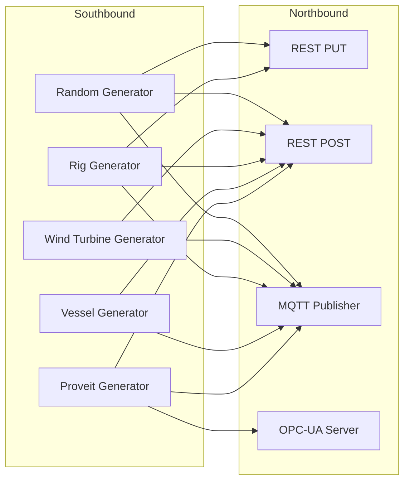

# Data Generator

Synthetic and file-based data publisher for **AnyLog / EdgeLake** environments.

Supports multiple industrial data models and publish methods including:

- REST (POST / PUT)
- MQTT
- OPC-UA (Server Mode)

---

# 🚀 Overview

This tool generates and publishes synthetic or file-based data into:

- AnyLog / EdgeLake
- MQTT brokers
- REST endpoints (POST / PUT)
- OPC-UA servers

It supports multiple industrial-style datasets and flexible publish options.

---

# 🏗 Architecture



**Southbound** generates data.  
**Northbound** handles publishing logic.

---

# 📊 Sample Data

All external sample datasets are hosted at:

👉 http://45.33.11.32/Sample-Data/

## Available Data Generators

### Random Data
`source/southbound/random_data.py`

- Auto-generated timestamp/value data
- Lightweight testing dataset

### Wind Turbine
`source/southbound/wind_turbine.py`

- Synthetic telemetry for 10 turbines
- Data split across multiple tables by data type

### Oil Rig
`source/southbound/rig_data.py`

- Synthetic data for 6 oil rigs
- Single large logical table

### Cruise Ship
`source/southbound/vessel_data.py`

- Battery data for cruise ship engines
- Split by engine side (DLB / DLT)

### Proveit 2026
`source/southbound/proveit_data.py`

- Factory dataset from Proveit 2026 conference
- Topic-based filtering
- Supports OPC-UA server mode

---

# 📡 Publishing Options

| Method  | Description | Supported Datasets |
|----------|------------|-------------------|
| PRINT | Output to console only | All |
| PUT | REST PUT | Random, Oil Rig |
| POST | REST POST | All except limitations per dataset |
| MQTT | MQTT publish | All except PUT-only limits |
| OPC-UA | OPC-UA server (default port 4840) | Proveit only |

---

# 🧪 Example Commands

```bash
# Print random data to console
python generator.py random print

# Publish rig 1 and 3 via MQTT
python generator.py rig mqtt --conn 127.0.0.1:32150 --rig-ids 1 3

# Same as above (comma separated)
python generator.py rig mqtt --conn 127.0.0.1:32150 --rig-ids=1,3

# Publish all wind turbines except 4 via POST
python generator.py wind-turbine post --conn 127.0.0.1:32149

# Publish only turbines 2 and 7
python generator.py wind-turbine post --conn 127.0.0.1:32149 --turbine-ids=2,7

# Publish vessel DLB only
python generator.py vessel mqtt --conn 127.0.0.1:32150 --vessel-ids DLB

# Start OPC-UA server for Proveit dataset
python generator.py proveit opcua --conn 0.0.0.0:4840
```

---

# ⚙️ Development

## Project Structure

```
├── source
│   ├── northbound/        # Publishing logic (POST, PUT, MQTT, OPC-UA)
│   ├── policies/          # UNS + run msg client policies
│   └── southbound/        # Data generators
├── support.py             # Shared utilities
├── data_generator_main.py # Main entry point
├── uns_policies.py        # UNS generator
└── mapping_policies.py    # run msg client generator
```

---

# 📌 Project Status

- ✅ Northbound data publishing
- ✅ Southbound data generators
- ✅ Proveit demo (OPC-UA + MQTT)
- ⏳ run msg client per generator
- ⏳ UNS policy generator per dataset
- ⏳ Documentation expansion
- ⏳ Docker support

---

# 🛠 Recommended Next Steps

- Add Dockerfile
- Add requirements.txt
- Add CI workflow
- Add configuration examples
- Add dataset screenshots (optional)

---

# 🧾 License

Internal / Conference Demo (update as needed)
